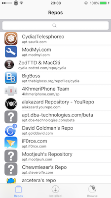

# jjjj

(working title)

If you just want to use jjjj, just add the repo http://cydia.r333d.com and install "jjjj" from there.

This is all of the app code for jjjj. This repo is exactly the same as what you'd find in `/var/lua/jjjj.app` on your device.

This app is written in Lua (using the LuaJIT ffi). There is some C code though, which can be found in [jjjj-core](http://github.com/rweichler/jjjj-core).

Entrypoint is `init.lua`. App launch entrypoint is `main.lua`. A lot of the app logic is in the `pages` directory. ObjC-to-Lua abstraction stuff is in `ns` and `ui`. deb/repo related stuff is in deb.lua and repo.lua.
